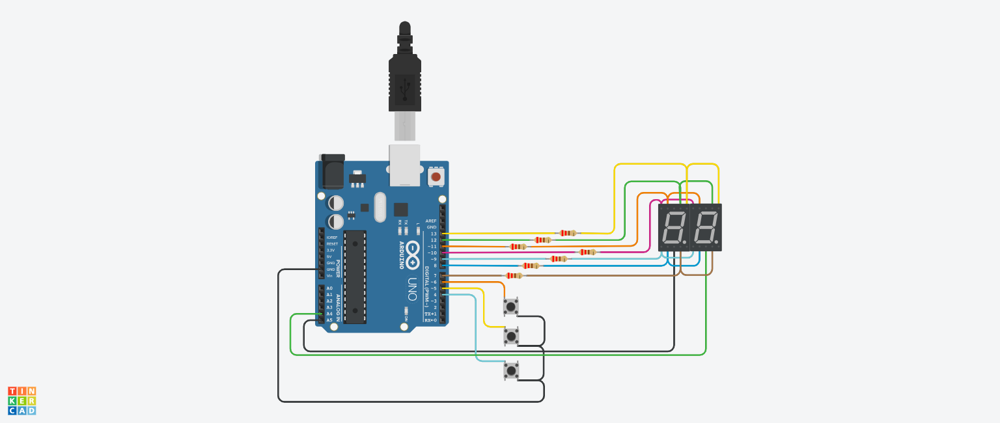

# [Primer Parcial]() 🔗


### [Integrantes]()
##### + Luján Miguel
##### + Martin Minuto
  
### [Proyecto: Contador de 0 a 99]() 🔗


### [Descripción]() 🔗
##### Contador de 0 a 99 dígitos utilizando la multiplexación en una placa Arduino Uno y dos displays de 7 segmentos. Contiene 3 pulsadores, para aumentar, disminuir y reiniciar la cuenta. 

### [Función principal]() 🔗
##### Esta función se encarga de controlar la multiplexación.
##### Recibe el parámetro contador y apaga ambos displays,determina cuál es el dígito a encender  en las decenas y lo muestra; vuelve a apagar ambos displays y luego determina cuál es el dígito a encender en las unidades y los muestra.


```C++
void imprimirCuenta(int contador)
{
    encenderDigito(APAGADOS);
    imprimirDigito(contador/10);
    encenderDigito(DECENAS);
    encenderDigito(APAGADOS);
    imprimirDigito(contador - 10*((int)contador / 10));
    encenderDigito(UNIDAD);
}
```
### [Diagrama]() 🔗


### :eyes: [Link al proyecto]() 🔗
+ [Proyecto](https://www.tinkercad.com/things/3eCkR0PgxvF)
  
### [Fuentes]() 🔗
+ [Videos clase](https://www.youtube.com/playlist?list=PL7LaR6_A2-E11BQXtypHMgWrSR-XOCeyD)
+ [Github documentación](https://docs.github.com/es/get-started/writing-on-github/getting-started-with-writing-and-formatting-on-github/basic-writing-and-formatting-syntax)
+ [Edraw Online](https://www.edrawmax.com/online/share.html?code=fb7e017c63a511ee8e0f0a54be41f961)
