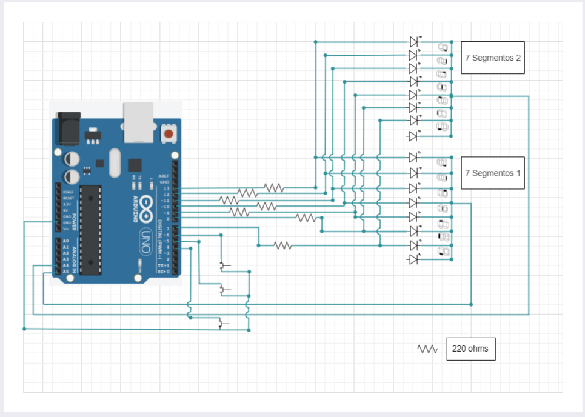

# <center><span style="color:white">[Primer Parcial]()</span> 
<p align="center">

</p>

***
### [Integrantes]()
+ Luján Miguel
+ Martin Minuto
  
***
### <span style="color:white">[Proyecto: Contador de 0 a 99]()</span> 

***

### [Descripción primera parte]() 

<p align="center">

</p>

Contador de 0 a 99 dígitos utilizando la multiplexación en una placa Arduino Uno y dos displays de 7 segmentos. Contiene 3 pulsadores, para aumentar, disminuir y reiniciar la cuenta. 

***

### [Descripción segunda parte]() 
<p align="center">

</p>

 Contador automático de 0 a 99. Utiliza un sensor de temperatura TMP36 para determinar el sentido de la cuenta; si la temperatura es menor a 20 °C la cuenta es regresiva; si la temperatura es mayor o igual a 20 °C, la cuenta irá en aumento a la vez que se encederá el motor de aficionado conectado a nuestro dispositivo.
 Además utiliza un interruptor deslizante, el cuál determinará si la cuenta muestra los números uno a uno, o solamente los números que sean primos. 


***
### [Funciones principales]()
Esta función se encarga de controlar la multiplexación.
Recibe el parámetro contador y apaga ambos displays,determina cuál es el dígito a encender  en las decenas y lo muestra; vuelve a apagar ambos displays y luego determina cuál es el dígito a encender en las unidades y lo muestra. Este proceso es realizado a gran velocidad, de manera tal que se hace indetectable para el ojo humano.


```C++
void imprimirCuenta(int contador)
{
    encenderDigito(APAGADOS);
    imprimirDigito(contador/10);
    encenderDigito(DECENAS);
    encenderDigito(APAGADOS);
    imprimirDigito(contador - 10*((int)contador / 10));
    encenderDigito(UNIDAD);
}
```
***
La siguiente función se encarga de determinar cuál es el próximo número primo a mostrar.
Recibe por parámetro el contador y la temperatura y utiliza un bucle while. En primer lugar llama a la función Primo() para determinar si el contador recibido es primo y mostrarlo, saliendo del bucle. En caso de no ser primo, utiliza la temperatura recibida para definir si la cuenta va en aumento o es regresiva y de esa manera encontrar el siguiente número primo a mostrar terminando el bucle.

```C++

int interruptor_on(int contador, int temperatura)
{  
  while (true)
  {
     if (Primo(contador))
     {
        return contador;
        break;   
     }
     else if (temperatura >= 20)
     {
        contador++;
        if (contador == 99)
        {
          contador = 1;
        }
     }
     else
     {
       contador--;
     }
  }  	
  return contador;
}
```

---
### [Diagrama primera parte]()


Utiliza los pines 7,8,9,10,11,12 y 13 como Outputs y están asociados a los leds de los dos displays. Si hubiese que utilizar un pin por cada led, no dispondríamos de pines para conectar los pulsadores. 
Los pines 4,5 y 6 son utilizados como Inputs para poder detectar cuándo es presionado alguno de los pulsadores y de ese modo controlar la cuenta. 
Por último, los pines A4 y A5 son utilizados como Outputs para controlar la multiplexación, encendiendo y apagando de manera coordinada ambos displays.

---
### [Descripción Dispositivos]() 
+ Display de 7 segmentos:
  
Es un componente que tiene 7 segementos LEDs que se encienden y se apagan, más un LED que hace de punto y es utilizado para posicionar el display.
Los displays de siete segmentos se utilizan en relojes digitales, medidores electrónicos, calculadoras básicas, pantallas de electrodomésticos, coches, y otros dispositivos que muestran información numérica.
En nuestro proyecto utilizamos displays de cátodo común, es decir, todos los cátodos están conectados a un pin común en este caso la conexión a tierra. Los LED los controla el estado de los pines de salida digital con la conexión a tierra apagada y la potencia encendida.
+ Sensor de temperatura (TMP36):
  
El sensor de temperatura TMP36 es un sensor de tipo analógico.
Es un dispositivo que transforma los cambios de temperatura en señales eléctricas, que luego pueden ser procesadas por equipos eléctricos o electrónicos como Arduino UNO.
La salida analógica en voltaje es directamente proporcional a la temperatura calibrada en ° C.
Rango de operación de −40 °C a +125 °C.

+ Motor de aficionado:
  
Es un motor de corriente continua, convierte energía eléctrica en energía mecánica provocando un movimiento rotatorio. Son motores cada vez más usados debido a que son muy fáciles de regular su velocidad y que simplemente con cambiar su polaridad, cambia su sentido de giro. Velocidades de giro habituales son 60, 120, 240 y 480 rpm, entre otras.
Los motores de aficionados son frecuentes para accionar ruedas de robots y vehículos.

+ Interruptor deslizable:
  
Es un dispositivo mecánico desplazable para aplicaciones de ON y OFF ya que puede abrir o cerrar el paso de corriente de un circuito. El interruptor deslizable tiene 3 pines, se puede implementarl para desviar o interrumpir el curso de una corriente eléctrica de algunas placas o módulos de electrónica. En nuestro proyecto lo incorporamos para cumplir con un control lógico, para habilitar un funcionamiento en específico.

***

### :eyes: [Link al proyecto]()
+ [Proyecto](https://www.tinkercad.com/things/3eCkR0PgxvF)
  
### :book: [Fuentes]()
+ [Videos clase](https://www.youtube.com/playlist?list=PL7LaR6_A2-E11BQXtypHMgWrSR-XOCeyD)
+ [Github documentación](https://docs.github.com/es/get-started/writing-on-github/getting-started-with-writing-and-formatting-on-github/basic-writing-and-formatting-syntax)
+ [Edraw Online](https://www.edrawmax.com/online/share.html?code=fb7e017c63a511ee8e0f0a54be41f961)
+ [Fun Tech Academy](https://funtechacademy.github.io/arduino/)
